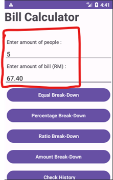
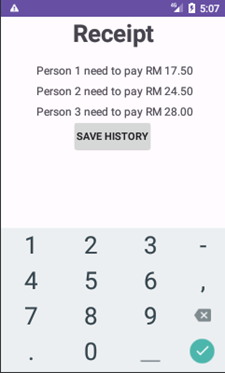
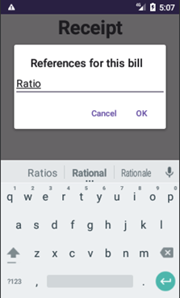

# Android Bill Calculator
This is university assignment. This a mobile application that developed in java by Android Studio.
Below are the functions that provided by this application.

* Break down
  * [Break Down by equal](#equal)
  * [Break Down by percentage](#percentage)
  * [Break down by ratio](#ratio)
  * [Break down by amount](#amount)
* [History](#history)

<h3> Break down by equal</h3>

1. Input the quantity of people and amount of the bill

2. Click on Equal Break-Down button

3.	Show The Receipt

4. Click on Save History and enter the reference for this bill

5.	Then Click on OK, this bill will be saved in the history. Else, it won’t be saved.

  <h3> Break down by percentage</h3>

1. Input the quantity of people and amount of the bill

6. Click on Percentage Break-Down button

6. Enter the percentage for each person then click on Calculate

6. Show the receipt

6. Then Click on OK, this bill will be saved in the history. Else, it won’t be saved.

 

  <h3> Break down by ratio</h3>

1. Input the quantity of people and amount of the bill

2. Click on Ratio Break-Down button

3. Enter ratio for each person then click on calculate

4. Show the receipt

5. Click on Save History and enter the reference for this bill

6. Then Click on OK, this bill will be saved in the history. Else, it won’t be saved.

 

  <h3> Break down by amount</h3>

1. Input the quantity of people and amount of the bill

2. Click on Amount Break-Down button

3. Enter amount for each person. The discrepancy will be shows above in real time. (When user enter an amount the bill will be change.)

4. The Calculate Show Receipt button only shown when the amount entered is correct.

5. show the receipt

6. Click on Save History and enter the reference for this bill

7. Then Click on OK, this bill will be saved in the history. Else, it won’t be saved.

  

   <h3> History</h3>

1. click on the check history button

2. It will show all the history that saved.

3.click on one of the history to save it as images in device.

4.Click on Yes to save, else cancel. 

5.The image can be check in the gallery. In the gallery, the image can share to others.

